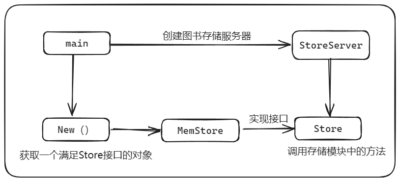
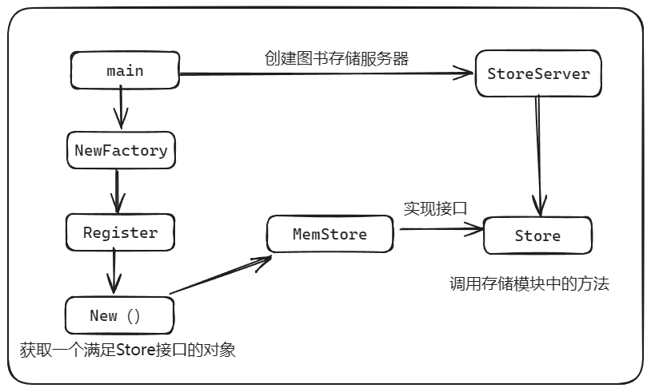

# simple-http-server
本项目是基于极客时间 TonyBai 老师的《Go 语言第一课》课程中对 _**Go 语言项目结构与设计思想的最佳实践**_
> 本项目在 TonyBai 老师的基础上进行修改，完善了注释，并且适配了 go1.22 ，例如：go1.22新增的路由写法 ``mux.HandleFunc("GET /book", handler)``

> 除此之外，还添加了另一种创建工厂的写法，在 `cmd/bookstore2/main.go` 中，可以自行查看流程
## 项目结构
```
├── cmd/
│ └── bookstore/ // 放置bookstore main包源码
│ └── main.go
├── go.mod // module bookstore的go.mod
├── go.sum
├── internal/ // 存放项目内部包的目录
│ └── store/
│ └── memstore.go
├── server/ // HTTP服务器模块
│ ├── middleware/
│ │ └── middleware.go
│ └── server.go
└── store/ // 图书数据存储模块
├── factory/
│ └── factory.go
└── store.go
```
> 两种创建工厂的写法



